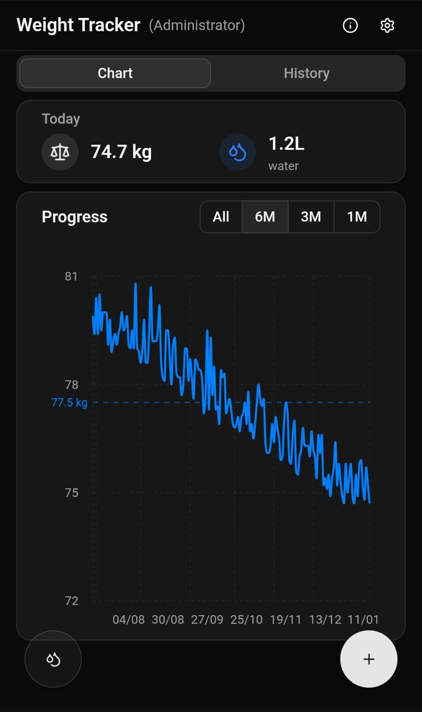
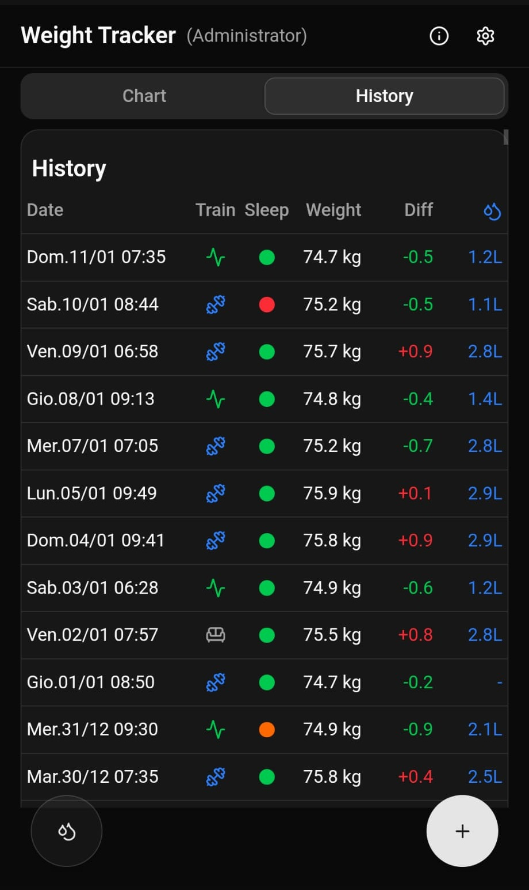
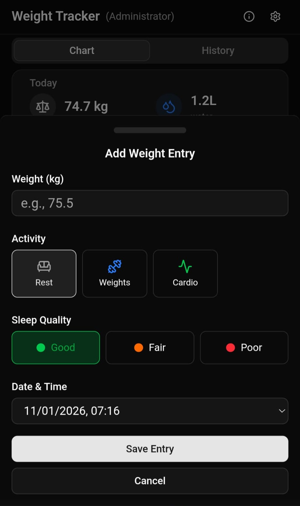
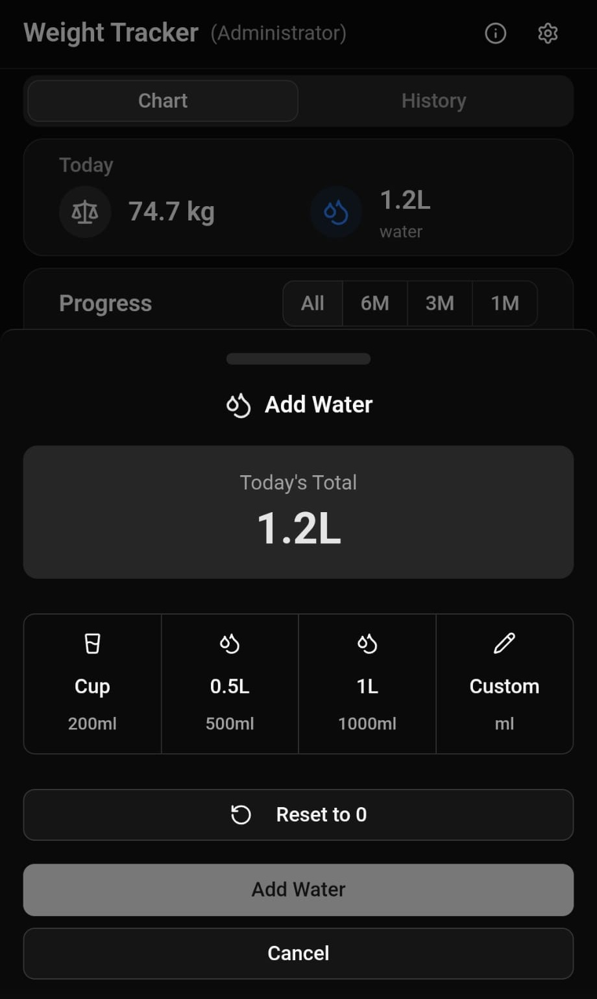

<h1 align="center">
  
  <br>
  Weight Tracker
</h1>

<p align="center">
  <strong>A self-hosted mobile-first weight tracking application to log your weight, water consumption, and fitness progress</strong>
</p>

<p align="center">
  <a href="https://hub.docker.com/r/yusseiin/weighttracker"></a>
  <a href="https://github.com/yusseiin/weighttracker/blob/main/LICENSE"></a>
  <a href="https://github.com/yusseiin/weighttracker/stargazers"></a>
  <a href="https://github.com/yusseiin/weighttracker/commits/main"></a>
  <br>
  
  
  
  
  
</p>

<p align="center">
  <a href="#features">Features</a> •
  <a href="#screenshots">Screenshots</a> •
  <a href="#getting-started">Installation</a> •
  <a href="#configuration">Configuration</a> •
  <a href="#development">Development</a>
</p>

---

## Screenshots

<p align="center">
  &nbsp;&nbsp;&nbsp;
  &nbsp;&nbsp;&nbsp;
  &nbsp;&nbsp;&nbsp;
  
</p>

---

## Features

### Core Tracking

- **Weight Tracking**: Log your daily weight with activity type and sleep quality
- **Water Consumption**: Track daily water intake with quick-add buttons (Cup 200ml/8oz, 0.5L/17oz, 1L/34oz), custom amount input, and reset functionality
- **Activity Logging**: Track activity type with each entry - includes 3 default activities (Rest, Weights, Cardio)
- **Sleep Quality**: Record sleep quality (Good, Fair, Poor) with color indicators alongside weight
- **Today Recap**: Quick summary card showing today's weight and water at a glance

### Custom Activities

- **Activity Manager**: Create, edit, delete, and reorder up to 12 custom activities
- **Icon Picker**: Choose from 50+ Lucide icons organized by category with search functionality
- **Color Customization**: Select from multiple Tailwind color options for each activity
- **Usage Protection**: Cannot delete activities that are being used by existing entries
- **Reordering**: Move activities up/down to customize the order they appear

### Data Visualization

- **Progress Chart**: Interactive line chart with Recharts showing weight trends
- **Time Filters**: View data for All time, 1 Month, 3 Months, or 6 Months
- **Chart Statistics**: Display average, min, and max weight in the selected period
- **Target Weight Line**: Optional reference line showing your goal weight
- **Customizable Colors**: Choose from 5 chart colors (Primary, Blue, Green, Orange, Purple)

### History & Entries

- **History Table**: Compact table view of all entries with weight, activity icon, sleep indicator, water, and weight difference
- **Click-to-Edit**: Tap any entry in the history to edit or delete it
- **Water Entry Editing**: Edit water entries directly from the history table
- **Weight Difference**: Automatic calculation showing change from previous entry

### Customization

- **Date Format Options**: 9 preset formats (EU, US, ISO, etc.) plus custom pattern support
- **Time Format**: Choose 24h (HH:mm), 12h (hh:mm a), or hide time
- **Locale Support**: English, Italian, German, French, Spanish
- **Weekday Display**: Optional weekday in date formatting
- **Separate Formatters**: Different date formats for table, chart tooltip, and chart axis
- **Unit Preferences**: Weight (kg/lb) and water (ml/oz) unit selection

### User Management

- **Multi-user Support**: Each user has their own data stored separately
- **User Roles**: Admin and regular user roles with different permissions
- **Admin Features**: Create, edit, and delete users from the settings popup
- **Password Management**: Users can change their own password
- **Nickname Management**: Users can change their display nickname
- **Secure Password Storage**: Passwords are hashed using bcrypt (automatic migration from plain-text)

### UI/UX

- **Mobile-First Design**: Responsive UI with bottom drawer on mobile, dialog on desktop
- **Floating Action Buttons**: Quick access to add weight (bottom right) and water (bottom left) on mobile
- **Dark Mode**: Automatic theme switching based on system preference
- **Toast Notifications**: Success and error feedback using Sonner
- **Changelog Dialog**: View version history and release notes with color-coded changes

### Data Storage

- **Offline-Ready Data**: JSON file storage for easy backup and portability
- **Docker Ready**: Configurable data path for container deployments

## Tech Stack

- **Framework**: Next.js 16 with App Router
- **UI**: shadcn/ui components with Tailwind CSS
- **Charts**: Recharts
- **Forms**: React Hook Form + Zod validation
- **Icons**: Lucide React
- **Notifications**: Sonner toast

## Getting Started

### Prerequisites

- Node.js 18+
- pnpm (recommended) or npm

### Installation

```bash
# Clone the repository
git clone https://github.com/yourusername/weight-tracker.git
cd weight-tracker/nextjserision

# Install dependencies
pnpm install

# Start development server
pnpm dev
```

Open [http://localhost:3000](http://localhost:3000) in your browser.

### Default Login

- **Username**: `admin`
- **Password**: `changeme`

## Configuration

### User Management

Admin users can manage users directly from the settings popup (gear icon in header):
- Create new users with username, password, nickname, and role
- Edit existing users (change nickname and role)
- Delete users (except yourself)

Users are stored in `/config/users/users.json` (or `CONFIG_PATH/users/users.json`):

```json
[
  {
    "username": "admin",
    "password": "",
    "nickname": "Administrator",
    "role": "admin",
    "createdAt": "2024-01-01T00:00:00.000Z"
  },
  {
    "username": "john",
    "password": "",
    "nickname": "John Doe",
    "role": "user",
    "createdAt": "2024-01-01T00:00:00.000Z"
  }
]
```

### Data Structure

Each user gets their own data files in separate folders inside the config directory:

```
/config/                        # Default path (configurable via CONFIG_PATH)
├── users/
│   └── users.json              # User credentials and roles
├── entries/
│   └── {username}.json         # Weight entries per user
├── settings/
│   └── {username}.json         # Settings per user
└── water/
    └── {username}.json         # Water consumption per user
```

### Environment Variables

| Variable | Description | Default |
|----------|-------------|---------|
| `CONFIG_PATH` | Directory for storing JSON data files | `/config` |
| `PUID` | User ID for file permissions (Unraid) | `1000` |
| `PGID` | Group ID for file permissions (Unraid) | `1000` |

## Docker Deployment

### Using Pre-built Image

```bash
docker pull yusseiin/weighttracker:latest
```

### Docker Run

```bash
docker run -d \
  --name weight-tracker \
  -p 3000:3000 \
  -v /path/to/config:/config \
  -e PUID=1000 \
  -e PGID=1000 \
  yusseiin/weighttracker:latest
```

### Docker Compose

```yaml
services:
  weight-tracker:
    image: yusseiin/weighttracker:latest
    container_name: weight-tracker
    ports:
      - "3000:3000"
    volumes:
      - /path/to/config:/config
    environment:
      - PUID=1000
      - PGID=1000
    restart: unless-stopped
```

### Build from Source

```bash
# Clone the repository
git clone https://github.com/yourusername/weight-tracker.git
cd weight-tracker/nextjserision

# Build the Docker image
docker build --build-arg NEXT_PUBLIC_VERSION=1.0.0 -t weight-tracker .

# Run
docker run -d -p 3000:3000 -v /path/to/config:/config weight-tracker
```

## Unraid Deployment

### Manual Installation

1. Go to Docker tab → Add Container
2. Fill in the following:
   - **Name**: `weight-tracker`
   - **Repository**: `yusseiin/weighttracker:latest`
   - **Network Type**: Bridge
   - **Port Mapping**: Container Port `3000` → Host Port `3000`
   - **Volume Mapping**: Container Path `/config` → Host Path `/mnt/user/appdata/weight-tracker`
   - **PUID**: `99` (or your user ID)
   - **PGID**: `100` (or your group ID)

### Unraid Template Variables

| Variable | Container Path | Host Path | Description |
|----------|---------------|-----------|-------------|
| Config | `/config` | `/mnt/user/appdata/weight-tracker` | Data storage |
| Port | `3000` | `3000` | Web UI port |
| PUID | - | `99` | User ID |
| PGID | - | `100` | Group ID |

## Project Structure

```
nextjserision/
├── app/
│   ├── api/
│   │   ├── auth/               # Authentication endpoints
│   │   │   ├── login/          # Login endpoint
│   │   │   ├── logout/         # Logout endpoint
│   │   │   ├── me/             # Get current user
│   │   │   ├── change-password/ # Change password
│   │   │   └── change-nickname/ # Change nickname
│   │   ├── entries/            # Weight entries CRUD
│   │   ├── settings/           # User settings
│   │   ├── users/              # User management (admin only)
│   │   └── water/              # Water tracking
│   ├── login/                  # Login page
│   ├── settings/               # Settings page
│   ├── layout.tsx              # Root layout
│   └── page.tsx                # Main dashboard
├── /config/                    # Data storage (Docker volume mount)
│   ├── users/                  # User credentials folder
│   ├── entries/                # Weight entries folder
│   ├── settings/               # Settings folder
│   └── water/                  # Water consumption folder
├── components/
│   ├── ui/                     # shadcn components
│   ├── weight-chart.tsx        # Chart component
│   ├── weight-tracker.tsx      # Main tracker with tabs
│   ├── entries-table.tsx       # History table view
│   ├── today-recap.tsx         # Today's weight and water summary
│   ├── add-entry-dialog.tsx    # Add entry form (drawer/dialog)
│   ├── edit-entry-dialog.tsx   # Edit/delete entry
│   ├── add-water-dialog.tsx    # Add water form (drawer/dialog)
│   ├── settings-page.tsx       # Full settings page
│   ├── settings-popup.tsx      # Settings popup in header
│   ├── activity-manager.tsx    # Custom activity CRUD
│   ├── icon-picker.tsx         # Icon selection with search
│   ├── dynamic-icon.tsx        # Render Lucide icon by name
│   ├── changelog-dialog.tsx    # Version history display
│   ├── change-password-dialog.tsx  # Password change form
│   └── user-management-dialog.tsx  # Admin user management
├── hooks/
│   ├── use-mobile.ts           # Mobile detection
│   ├── use-weight-entries.ts   # Weight data management hook
│   └── use-water.ts            # Water data management hook
├── lib/
│   ├── auth.ts                 # Authentication utilities
│   ├── data.ts                 # Data storage utilities
│   ├── water.ts                # Water storage utilities
│   ├── icons.ts                # Curated icon list with categories
│   ├── date-utils.ts           # Date formatting utilities
│   ├── water-utils.ts          # Water unit conversion utilities
│   ├── types.ts                # TypeScript types
│   └── utils.ts                # Utility functions
└── middleware.ts               # Route protection
```

## API Endpoints

### Authentication

| Method | Endpoint | Description |
|--------|----------|-------------|
| POST | `/api/auth/login` | Login with username/password |
| POST | `/api/auth/logout` | Clear session |
| GET | `/api/auth/me` | Get current user |
| POST | `/api/auth/change-password` | Change password |
| POST | `/api/auth/change-nickname` | Change display nickname |

### Entries

| Method | Endpoint | Description |
|--------|----------|-------------|
| GET | `/api/entries` | List all entries |
| POST | `/api/entries` | Create new entry |
| DELETE | `/api/entries/[id]` | Delete entry |
| PATCH | `/api/entries/[id]` | Update entry |

### Settings

| Method | Endpoint | Description |
|--------|----------|-------------|
| GET | `/api/settings` | Get user settings |
| PUT | `/api/settings` | Update settings |

### Water

| Method | Endpoint | Description |
|--------|----------|-------------|
| GET | `/api/water` | Get today's water (or ?date=YYYY-MM-DD or ?all=true for all entries) |
| POST | `/api/water` | Add water to today's total |
| PATCH | `/api/water` | Set water amount for specific date |
| DELETE | `/api/water` | Reset today's water to 0 |

### Users (Admin Only)

| Method | Endpoint | Description |
|--------|----------|-------------|
| GET | `/api/users` | List all users |
| POST | `/api/users` | Create new user |
| PATCH | `/api/users/[username]` | Update user |
| DELETE | `/api/users/[username]` | Delete user |

## Data Models

### User

```typescript
{
  username: string;
  password: string;
  nickname: string;
  role: 'admin' | 'user';
  createdAt: string;          // ISO 8601
}
```

### Weight Entry

```typescript
{
  id: string;
  author: string;
  weight: number;
  training: string;           // Activity ID (e.g., 'rest', 'weights', 'cardio', or custom ID)
  sleep: 0 | 1 | 2;           // 0=Good, 1=Fair, 2=Poor
  timestamp: string;          // ISO 8601
}
```

### Water Entry

```typescript
{
  id: string;
  author: string;
  date: string;             // YYYY-MM-DD (one per day)
  amount: number;           // Total ml for the day
  updatedAt: string;        // ISO 8601
}
```

### Custom Activity

```typescript
{
  id: string;                 // Unique identifier (e.g., 'rest', 'weights', 'swimming')
  label: string;              // Display name (e.g., 'Swimming')
  icon: string;               // Lucide icon name (e.g., 'Waves')
  color: string;              // Tailwind color class (e.g., 'text-cyan-500')
}
```

### User Settings

```typescript
{
  userId: string;
  unit: 'kg' | 'lb';
  waterUnit: 'ml' | 'oz';
  targetWeight: number | null;
  chartColor: 'primary' | 'blue' | 'green' | 'orange' | 'purple';
  activities: CustomActivity[];  // User's custom activities (max 12)
  dateFormat: {
    dateFormat: string;       // 'dd/MM/yyyy', 'MM/dd/yyyy', etc.
    customDateFormat?: string; // For custom patterns
    timeFormat: string;       // 'HH:mm', 'hh:mm a', 'none'
    locale: string;           // 'en', 'it', 'de', 'fr', 'es'
    showWeekday: boolean;
  };
  createdAt: string;
  updatedAt: string;
}
```

### Default Activities

New users start with these 3 default activities:

| ID | Label | Icon | Color |
|----|-------|------|-------|
| `rest` | Rest | Sofa | `text-muted-foreground` |
| `weights` | Weights | Dumbbell | `text-blue-500` |
| `cardio` | Cardio | Activity | `text-green-500` |

### Available Icon Categories

The icon picker includes 50+ icons organized by category:

| Category | Icons |
|----------|-------|
| Fitness | Dumbbell, Activity, Bike, Timer, Trophy, Target, Flame, Zap |
| Sports | Waves, Mountain, Footprints, PersonStanding |
| Rest | Sofa, Moon, Coffee, Bed, Armchair |
| Health | Heart, HeartPulse, Pill, Stethoscope, Apple, Salad |
| General | Star, Circle, Square, Plus, Check, X |

### Activity Color Options

| Color Class | Description |
|-------------|-------------|
| `text-muted-foreground` | Muted gray (default) |
| `text-blue-500` | Blue |
| `text-green-500` | Green |
| `text-red-500` | Red |
| `text-orange-500` | Orange |
| `text-purple-500` | Purple |
| `text-cyan-500` | Cyan |
| `text-pink-500` | Pink |
| `text-yellow-500` | Yellow |

### Chart Color Options

| Value | Description |
|-------|-------------|
| `primary` | Default theme color (adapts to light/dark mode) |
| `blue` | Blue (#0066FF) - Default for new users |
| `green` | Green (#22C55E) |
| `orange` | Orange (#F97316) |
| `purple` | Purple (#A855F7) |

### Date Format Options

| Preset | Example | Description |
|--------|---------|-------------|
| `dd/MM/yyyy` | 06/01/2025 | European format |
| `MM/dd/yyyy` | 01/06/2025 | US format |
| `yyyy-MM-dd` | 2025-01-06 | ISO format |
| `dd MMM yyyy` | 06 Jan 2025 | Month name |
| `EEE dd/MM` | Mon 06/01 | Weekday with date |
| `EEE.dd/MM` | Mon.06/01 | Weekday.date |
| `custom` | User-defined | Custom pattern |

### Date Format Tokens

When using custom date format, these tokens are available (date-fns format):

| Token | Example | Description |
|-------|---------|-------------|
| `dd` | 06 | Day of month (2 digits) |
| `d` | 6 | Day of month |
| `MM` | 01 | Month (2 digits) |
| `MMM` | Jan | Month abbreviation |
| `MMMM` | January | Full month name |
| `yyyy` | 2025 | Full year |
| `yy` | 25 | 2-digit year |
| `EEE` | Mon | Weekday abbreviation |
| `EEEE` | Monday | Full weekday name |
| `HH` | 14 | Hour 24h (2 digits) |
| `hh` | 02 | Hour 12h (2 digits) |
| `mm` | 30 | Minutes (2 digits) |
| `a` | PM | AM/PM |

### Supported Locales

| Code | Language | Weekday Example |
|------|----------|-----------------|
| `en` | English | Mon, Tue, Wed |
| `it` | Italian | Lun, Mar, Mer |
| `de` | German | Mo, Di, Mi |
| `fr` | French | Lun, Mar, Mer |
| `es` | Spanish | Lun, Mar, Mié |

## Development

```bash
# Run development server
pnpm dev

# Build for production
pnpm build

# Start production server
pnpm start

# Type checking
pnpm tsc --noEmit
```

## License

MIT
